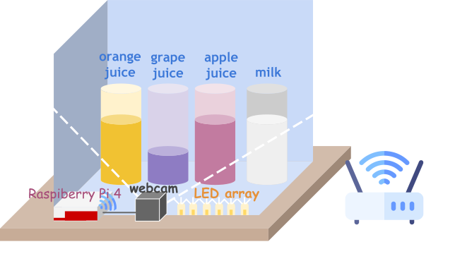
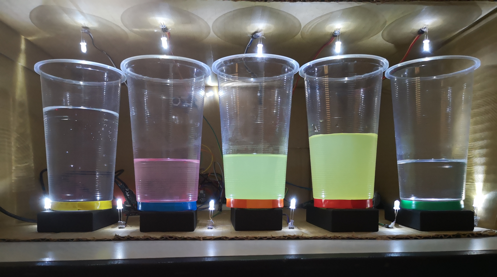
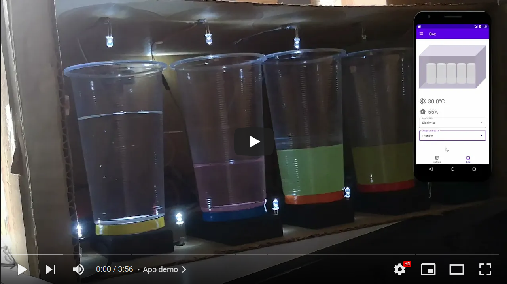
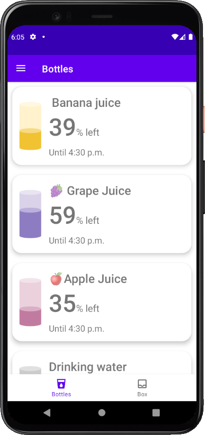
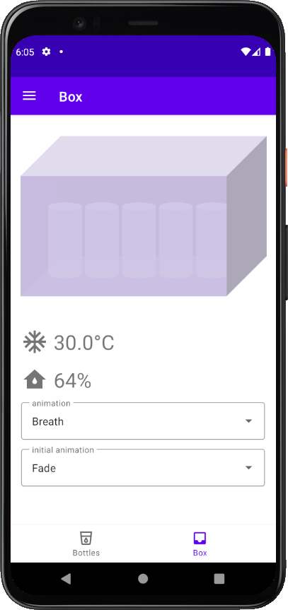
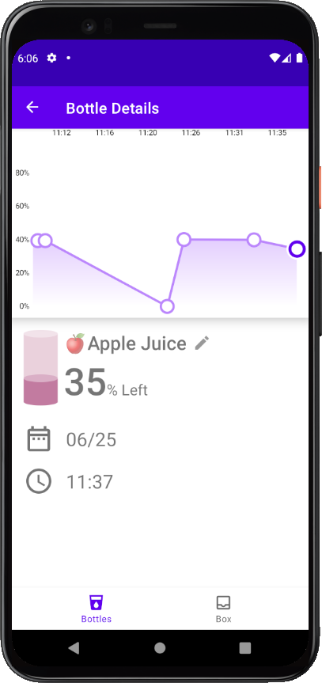
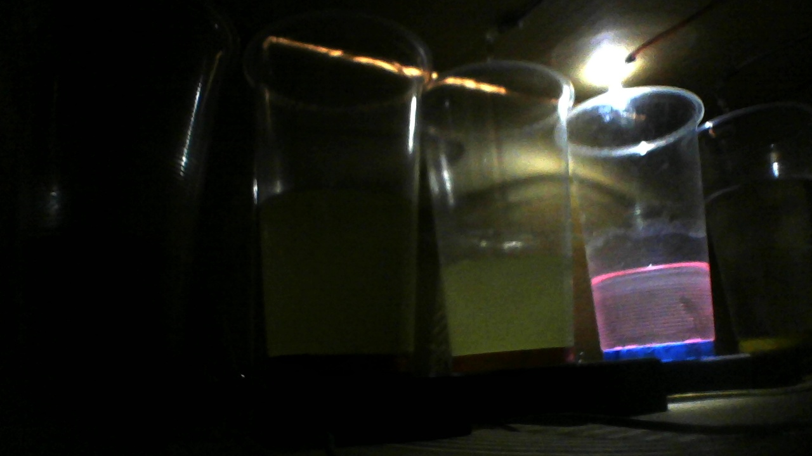
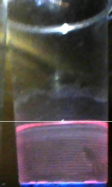
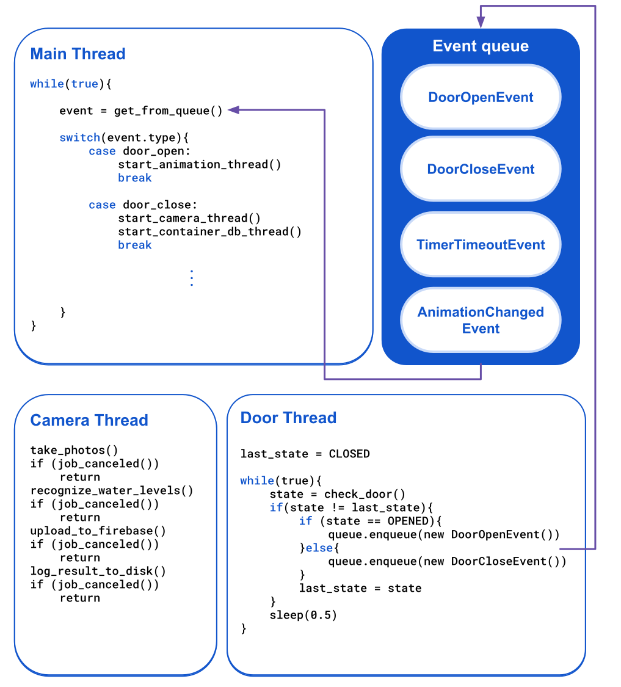
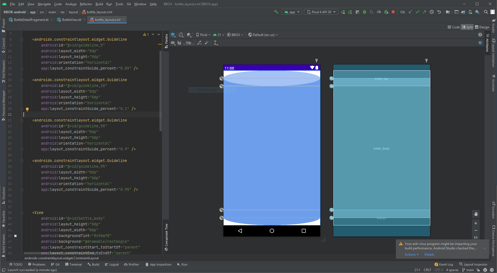

# BBox (Beverage Box)
This is our final project for IoT(Internet of Things) course here at Department of Computer Science in NPTU(National Pingtung University). The system provides a way for users to remotely monitor the amount of liquid left in each bottle in a beverage box using Android app. The container (beverage box) itself can be extended to suit the need of the liquid to be stored. For example, if you want to store beverages, you can install a compressor to keep them cool.

## Demo Video

## Screenshots

## Main Features
1. Users can pour liquid into bottles labeled with color.
2. Users can name each bottle using the Android app.
3. Users can monitor the amount of liquid left, the state of the door of the container, temperature and humidity in the container remotely using the Android app.
4. The system will automatically measure the amount of remaining liquid, temperature and humidity in the container and display those data on the Android app in realtime.
5. When the door is first opened, the container should play the initial animation. If the door remains open after initial animation, another animation set using the Android app will be played so that users can see the bottles clearly.
## System Architecture
### Edge (Beverage box itself)
* Hardware: Any Raspberry Pi running Raspberry Pi OS
* Role:
    * detect the state of the door via the ultrasonic sensor connected using GPIO pins
    * use webcam to detect the amount of liquid left in each bottle
    * upload detected data to the cloud database
* Tech Stack: Python, Gpiozero, OpenCV

### Backend
* Role: Save the statistics of the container and serve as a bridge between the container and the Android phone.
* Tech Stack: Google Firebase
### Android devices
* Hardware: Any devices running Android 6.0 or newer.
* Role: 
    * interact with user
    * present the status of the container in an easy-to-understand fasion
    * a place where user can configure the name of each bottle, initial animation and animation that is played when the door remained open after initial animation

## Water-level detection algorithm
After hours of trial and error, we found that the easiest way to detect water level of each bottle is to only light up the single LED on top of the bottle being captured, which means we have to detect water level bottle by bottle. While this method can be a bit more time-consuming compared to methods that detect water level of all bottles with single image, this method is more stable and accurate and works quite well with Raspberry Pi 4's limited computing capability.

 ## Multi-threading
The behavior model of the container is quite complicated. For example, when the user close the door of the container, the container should do the following things all at once:
* Measure water-level bottle by bottle
* Upload the "door closed" status to the cloud
* Upload the newly detected water level of all the bottles after measurement process is complete

If the user open the door while the above-mentioned tasks are still running or pending, the container has to handle this situation gracefully, which can be very difficult to achieve if the program is structured in a single-threaded way. Thus, we have adopted a multi-threaded strategy.

Inspired by NodeJS's **event queue** mechanism, we have our main thread first create all the threads that are required to be running all the time (e.g. thread that detect the state of the door periodically). After initialization procedure is done, the main thread will constantly pull events from the event queue, handling them one by one. When a thread wants to communicate with the main thread, it can push an event to the queue, which will then be pulled by the main thread. Long-running threads are required to check constantly whether their job is cancelled or not after each small steps, so that they can be cancelled as early as possible to avoid wasting resources running jobs that are no longer required.

## Animation
In order to improve user experience, we choose to add animation to our bottle graphics. Specifically, we want the water level of the bottle graphics to increase gradually until the actual water level. Initially, we have decided to achieve this with Android's AnimatedVectorDrawable. However, the AnimatedVectorDrawable does not support masking capibility on low API-level, which can causes problem on devices running old versions of Android. Thus, we switched to use constraint layout to build our bottle graphics, and apply view animation to achieve the above-mentioned effects.
